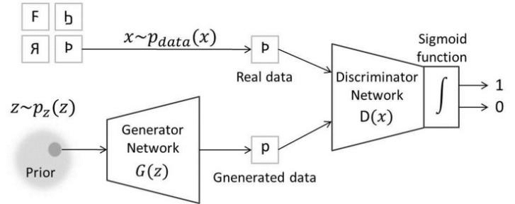
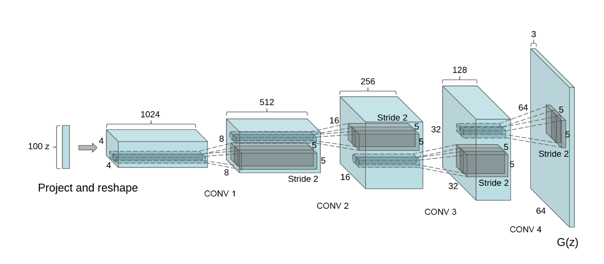
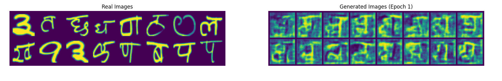
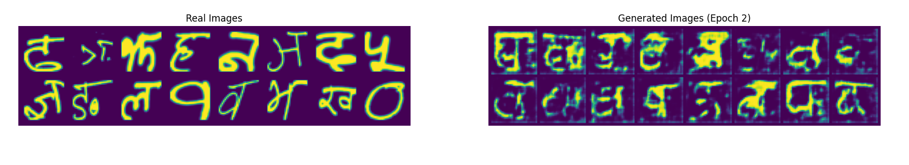
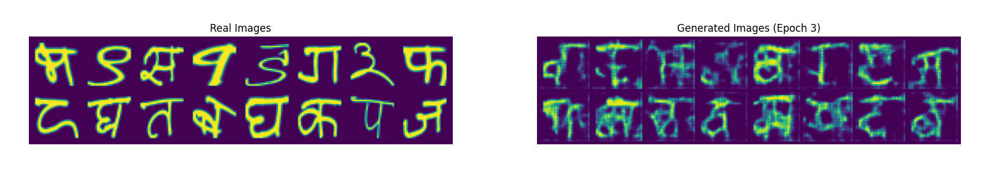
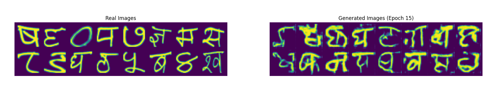
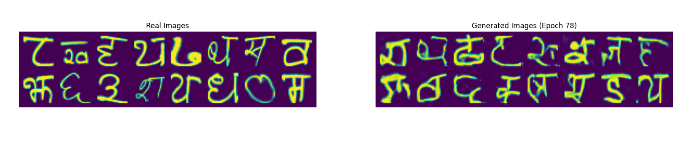
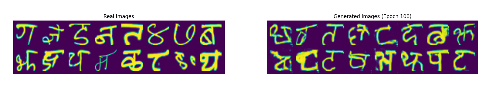

# Devnagri-character-generator
Generate alphabets and numbers from devnagri script using GAN and its different variations

This repository contains a Generative Adversarial Network (GAN) implemented in PyTorch to generate handwritten Devanagari character images, using the Devanagari dataset. The goal of this project is to train a GAN model capable of generating realistic images of Devanagari characters and numerals.

---
### Dataset

The Devanagari dataset consists of 90,000 grayscale images of handwritten Devanagari numerals and characters each of size 32x32 pixels. The dataset is structured similarly to the well-known MNIST dataset but represents the numerals in the **Devanagari script**, commonly used in **Hindi** and other Indian languages.

You can download the dataset from the following link: [Devanagari dataset](https://www.kaggle.com/datasets/berlinsweird/devanagari).

---

## Model Overview

This project implements a standard GAN with the following components:

• **Generator:** A neural network that generates images from random noise (latent space).

• **Discriminator:** A neural network that tries to distinguish between real images from the dataset and fake images produced by the generator.

Both networks are trained in an adversarial manner, with the generator trying to fool the discriminator and the discriminator learning to identify real vs. fake images.

---
### **Loss Function**

$$L_{GAN}(\theta, \phi) = \min_{\phi} \max_{\theta} \left( E_{x \sim p_{data}(x)}[\log(D_{\theta}(x))] + E_{z \sim p_z(z)}[\log(1 - D_{\theta}(G_{\phi}(z)))] \right)$$

where $\theta$ and $\phi$ are discriminator and generator parameters respectively.

We can further split the loss into Generator and Discriminator Loss

**1. Discriminator Loss:**
 
 
$$L_D(\theta) = \max_{\theta}\ \left( E_{x \sim p_{data}(x)}[\log(D_{\theta}(x))] + E_{z \sim p_z(z)}[\log(1 - D_{\theta}(G_{\phi}(z)))] \right)$$ 

Generator parameters $\phi$ are frozen

**2. Generator Loss:**
 
 
$$L_G(\phi) = \min_{\phi} \left( E_{z \sim p_z(z)} \left[ \log (1\ - \ D_{\theta}(G_{\phi}(z))) \right] \right)$$

Discriminator parameters $\theta$ are frozen 
We sucessively optimise loss for generator and discriminator keeping parameters of other as constant

---
### GAN Architecture

The Architecture used is [DCGAN](https://arxiv.org/pdf/1511.06434).

• **Generator:** Fully connected layers followed by transposed convolutions to upsample the noise vector into a 32x32 image. 
• **Discriminator:** Convolutional layers followed by fully connected layers to classify images as real or fake.

---

## Implementatiaon

	Set all the necessaary hyperparameters and run main.py

- **DEVICE:** This sets the hardware device for training, either CUDA (GPU) or CPU.

- **DTYPE:** Defines the data type for the tensors in the model. [default: torch.float32]

- **ROOT_DIRECTORY:** Path where the training dataset is stored. 

- **SAVE_PATH:** Directory where generated images will be saved after training.

- **BATCH_SIZE:** [default: 128]

- **NUM_EPOCHS:** [default: 100]

- **BETAS:** Parameters for the Adam optimizer, controlling the exponential decay rates for the first ($\beta_1$) and second ($\beta_2$) moment estimates. [default: (0.5, 0.999)]

- **LEARNING_RATE_DISCRIMINATOR:** [default: 0.0001]

- **LEARNING_RATE_GENERATOR:** [deafult: 0.0002]

- **MAX_GRAD_NORM:** clip the gradient norms to prevent exploding gradients. [default: 1]

---

## RESULTS

---

## Training Best Practices

GAN's are notoriously difficult to train this the due to the loss function which is a **saddle point** optimization problem. Such problems do not easily converge to a solution hence a lot of hyperparameter tuning is required

I've followed some of the recommended practices that help in stabilizing GAN training:

**1.** The generator loss is given by
$$L_G(\phi) = \min_{\phi} \left( E_{z \sim p_z(z)} \left[ \log (1\ - \ D_{\theta}(G_{\phi}(z))) \right] \right)$$ in practice is has been found that instead 
$$L_G(\phi) = \max_{\phi} \left( E_{z \sim p_z(z)} \left[ \log (D_{\theta}(G_{\phi}(z))) \right] \right)$$ works much better as it provides necessary early gradients to the generator
 

**2.** Use of inverted labels, that is 0 for real images and 1 for fake images
 

**3.** Use of label smoothing where real labels are uniformly distributed between 0 - 0.1 and fake labels are uniformly distributed between 0.9 - 1.0

**4.** Add small amount of gaussian noise to real training samples

**5.** Use gradient clipping to limit gradient norms 

